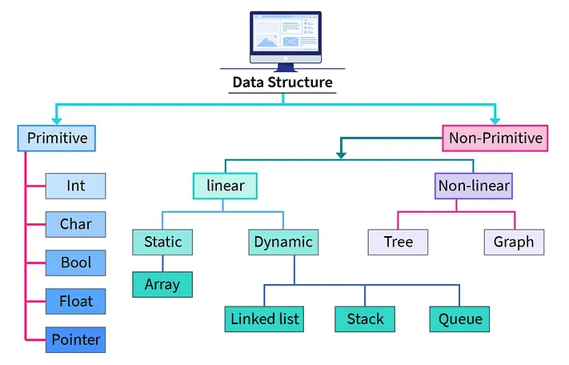

# What are data structures?

Data structures are ways to organize and store data so that it can be accessed and modified efficiently. They provide a means to manage large amounts of data in efficient manners.

Common examples include: arrays, linked lists, stacks, queues, trees, and graphs.

In the context of coding interviews, it is useful to know the functions and operations among all of these structures because that will allows us to pick the better one depending on any given problem.

Types of data structures

## Additional resources
This is an interesting  [article to dive deeper](https://python.plainenglish.io/understanding-python-data-structures-from-basics-to-advanced-7cf84212a373) on data structures

## Summary
They're collections of data we can use to solve problems more efficiently