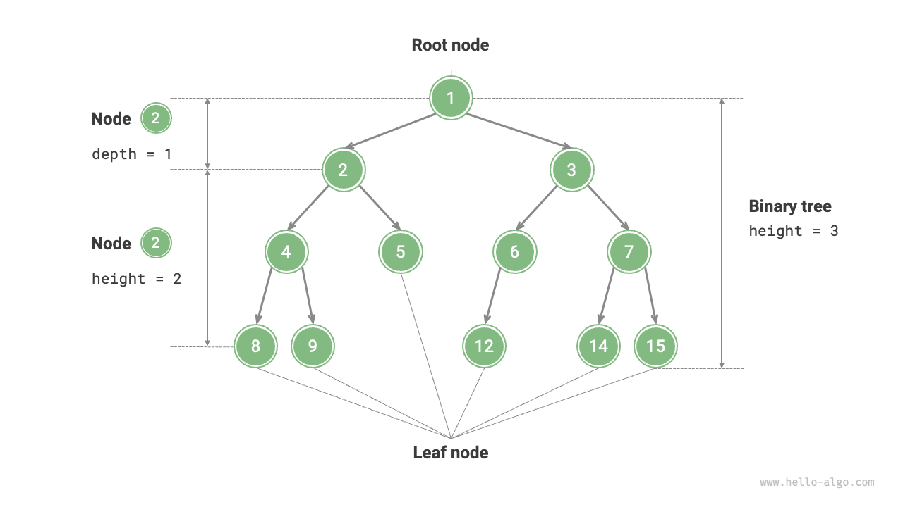

# Trees

Also called as binary tree. Each node has two child nodes. All nodes point downward, otherwise it would be considered a graph. Each node can only have one parent.

### Physical representation (binary tree)
First node in the tree is the root node. Going down in the tree there's a depth that increases by one on each level.
The last nodes on the tree are called leaf nodes

### Key concepts
- branches: paths from root node to bottom node
- leaf nodes: bottom nodes
- depth/height: how far down one tree goes, number of levels

### Types of trees
- binary search trees BSTs
- min/max heap trees
- k-nary trees
- trees having children pointing back to parent nodes (most do not have pointers back to the parent)
- complete: all levels are filled up completely, from left to right, height difference between the left and right subtrees is at most 1
- full: if every node either has no children or k children
- perfect: all leaf nodes has the same depth

#### Balanced Tree
Trees are not always similar in the amount of nodes by subtree, they could be either balanced/unbalanced

### Time/Space complexity
- O(N) S directly proportional to the number of nodes
- O(N) T if we need to traverse through all nodes of a tree
- O(logN) T most of the time! as long as it is balanced. If we need to traverse a binary tree through only one subtree. Explanation:
  - On each iteration we eliminate half on the input (nodes of tree each step of the way)
  - This is usually the case for a balanced binary tree (similar amount of nodes through the whole tree)